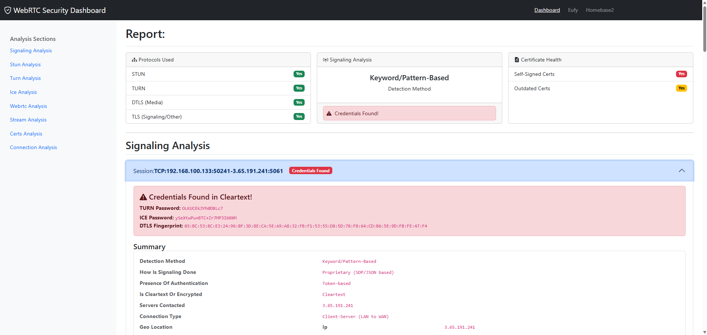

# WebRTCChecker
## WebRTC Security Analysis

**WebRTCChecker** is a comprehensive framework for analyzing the security of WebRTC communications from network captures (**PCAP files**) and presenting the findings in an interactive, web-based dashboard.  

It is designed for **security researchers, pentesters, and developers** to quickly assess the security posture of IoT devices and web applications that rely on Real-Time Communication protocols.



---

## 🐳 Pull and Run with Docker

Pull the published image from Docker Hub:

```bash
docker pull christoph0sanders/webrtcchecker:1.0.2
```

Run the container:

```bash
docker run -d --name webrtc-checker -p 5000:5000 christoph0sanders/webrtcchecker:1.0.2
```

Open the web interface at:

```text
http://127.0.0.1:5000
```

## 🚀 Setup & Installation

### Prerequisites
- Python **3.8+**
- Pip package manager

### Install dependencies
```bash
pip install -r requirements.txt
```

## Usage

### Step 1: Capture Traffic
- **Unencrypted or TLS-encrypted HTTP/1.1 traffic:**  
  Capture a standard PCAP.

- **QUIC / HTTP/2 / HTTP/3 / Encrypted WebSocket traffic:**  
  1. **Generate SSLKEYLOGFILE**  
     Set an environment variable before launching your browser to save TLS keys.  
  2. **Extract Keys in wireshark**
    Extract Secrets
  3. **Run with Tshark**
     ```
    tshark -r capture.pcapng -o tls.keylog_file:key.txt -w decrypted.pcapng
     ```


### Step 2: Run the Application
```bash
python app.py
```

## Project Structure

/WebRTCChecker
│
├── app.py # Main Flask web application
├── main.py # Analysis script for IoT devices
├── main_webapp.py # Analysis script for Web Apps
├── requirements.txt # Python dependencies
│
├── pcaps/ # Uploaded PCAP files are stored here
│ └── MyCamera_Test/
│ └── capture.pcapng
│
├── results/ # Generated JSON reports are stored here
│ └── MyCamera_Test/
│ ├── signaling.json
│ ├── stun_analysis.json
│ └── ...
│
└── templates/ # Flask HTML templates
├── base.html
├── index.html
├── capture.html
├── folder_summary.html
└── partials/ # Reusable template components
├── _summary_card.html
├── _communication_map.html
└── ...

## Features

- **Web-Based Dashboard**  
  Flask-powered UI to browse, view, and manage analysis results.

- **Upload & Scan Pipeline**  
  Upload `.pcap` or `.pcapng` files directly through the web interface.

- **Hierarchical Report Browser**  
  Results grouped by device/application with collapsible navigation.

- **Aggregated Folder Summaries**  
  High-level overview across multiple captures to detect systemic issues.

- **Comprehensive Protocol Analysis**  
  Supports STUN, TURN, ICE, TLS, and DTLS traffic.

- **Intelligent Signaling Detection**  
  - **Keyword/Pattern-based:** Detects SIP, XMPP, SDP, and common WebRTC markers.  
  - **Heuristic fallback:** Identifies obfuscated/proprietary signaling via behavioral patterns.

- **Decrypted Traffic Analysis**  
  Specialized module for HTTP/2, HTTP/3, and WebSocket after SSLKEYLOGFILE-based decryption.

- **Cryptographic Assessment**  
  - Certificate trust (self-signed, expired, issuer).  
  - Cipher suite negotiation & strength.  
  - Presence of critical extensions.  

- **Media Stream Identification**  
  Detects major data streams and evaluates encryption via entropy analysis.

- **Universal Certificate Audit**  
  Extracts and analyzes all unique TLS/DTLS certificates.

- **Interactive Network Graph** *(vis.js powered)*  
  - Filter by protocol, data volume, or LAN abstraction.  
  - Aggregated edges with bandwidth-weighted visualization.  
  - Hover tooltips for IPs, protocols, and security notes.  

---

## 📖 License
*MIT*